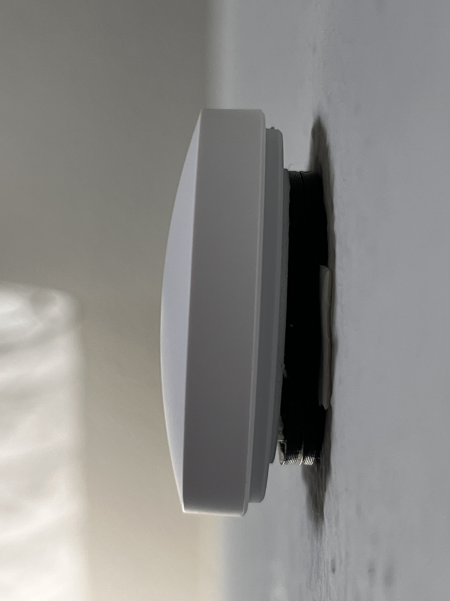
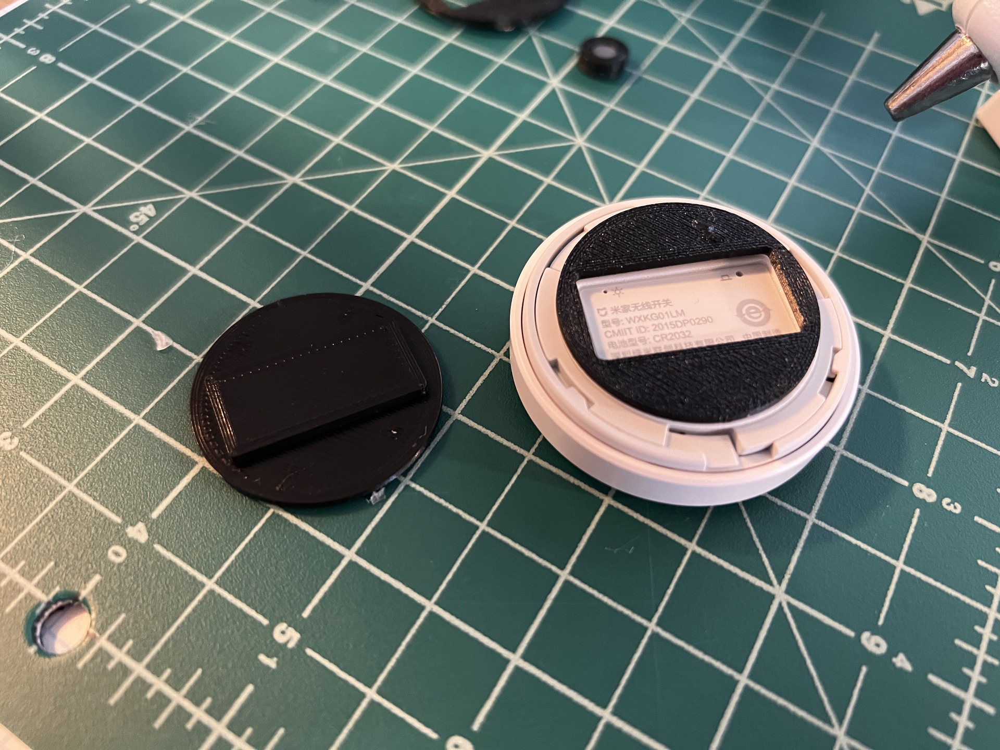
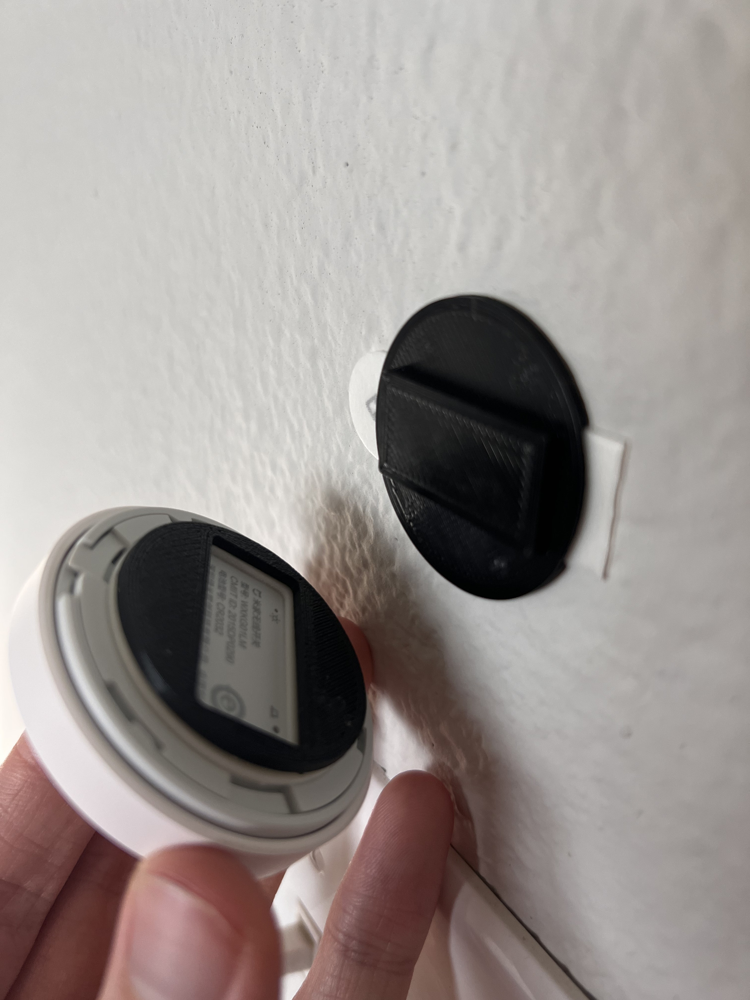
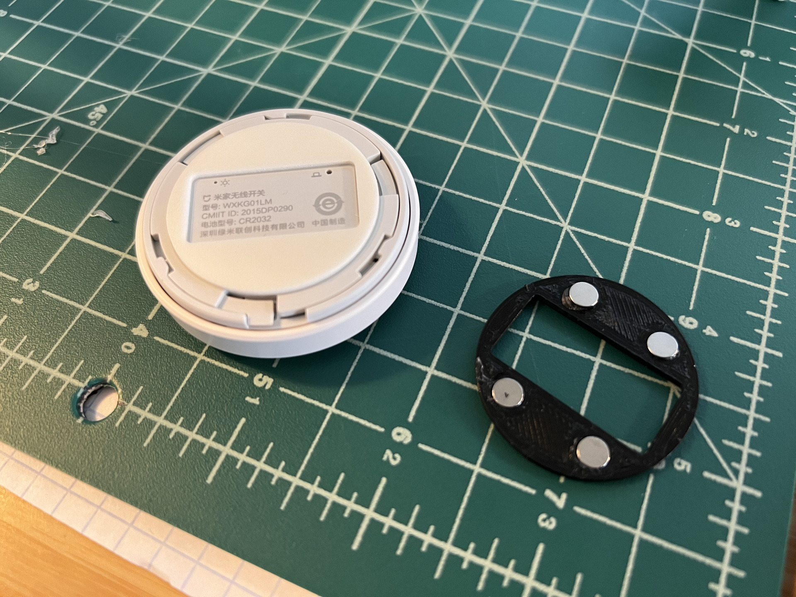

# Xiaomi button holder

This is a plate designed to affix a [Xiaomi Aqara button](https://www.aliexpress.com/item/32818007384.html) to a wall with a Command strip. It also allows buttons to be moved around between fixed wall plates.

The button ships with a strong permanent adhesive on the back. Previously, I would painstakingly remove the adhesive with a flathead screwdriver and a bottle of Goo-Gone, then affix a Command strip directly to the back. This process was time-consuming and made for a wobbly switch.

Designed to address these issues, this plate is divided into two portions, a button plate and a wall plate. The button plate is shaped precisely to the shape of the adhesive, and attaches directly to the button. The wall plate includes a cutout for a Command strip, and attaches to the wall. 

Each plates include holes for four [5mm x 1mm magnets](https://www.aliexpress.com/item/1005003692575702.html) to be glued in place for a more secure hold. It should work well enough without them, though. Pay close attention to the polarity when gluing them in!

## Recommended print settings

It's a relatively easy print - just ensure top/bottom thickness is sufficient so the plates aren't hollow. I used .2mm layers with .8mm tops/bottoms, and 20% infill for the raised section on the wall plate. I printed with supports, but blocked out the magnet holes, as the support proved difficult to remove from them.
